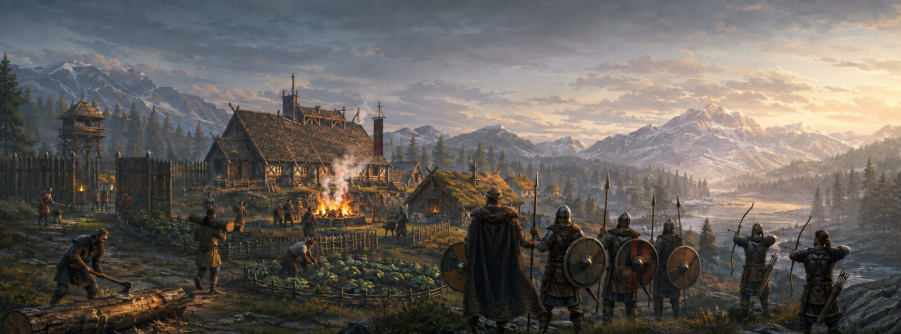
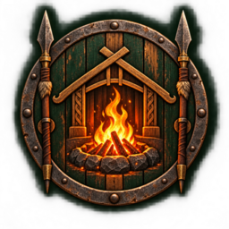

<p align="center">
  
</p>

<p align="center">
  
</p>

<h1 align="center">Hearth & Hird</h1>

<p align="center">
  <strong>A living Viking settlement and warband simulation for Valheim.</strong><br>
  Recruit people, build them a home, put tools in their hands and lead your own hird into battle.
</p>

<p align="center">
  <a href="releases/HearthAndHird-v1.13.5.zip"><strong>Download development build 1.13.5</strong></a>
  · <a href="docs/ROADMAP.md">Roadmap</a>
  · <a href="docs/MULTIPLAYER_TESTING.md">Multiplayer testing</a>
  · <a href="docs/UPSTREAMS.md">Licences and provenance</a>
</p>

> [!IMPORTANT]
> Hearth & Hird is under active development. Version **1.13.5** is a playable
> foundation and test build, not the finished settlement simulation. Back up
> important worlds before testing development releases.

## The idea

Valheim begins with one dead warrior. Hearth & Hird turns that lonely camp
into a community:

**you → followers → a camp → a settlement → a functioning Viking community → a warband**

NPCs are intended to be people in the world, not resource timers in a menu.
The defining goal is that a lumberjack must walk to a tree, equip an axe, fell
it, process the logs, collect the wood and physically carry it to storage.

The same principle applies to hauling, mining, farming, construction, patrols
and production chains. Distant settlements may use lower-frequency simulation
for performance, but work around the player should remain visible and real.

## What works in 1.13.5

### Human settlers

- Persistent Norse names, appearance, equipment, allegiance and level.
- Wild residents belong to one exact village rather than a global NPC faction.
- Villages remember their own relationship with each player.
- Residents defend themselves, return home after danger and are leashed to
  their village rather than wandering across the map.
- Escalating aggression: one unarmed punch causes a short brawl; repeated or
  armed attacks provoke a serious settlement response.
- Village hierarchy: Headmen/Headwomen, Elders, Jarls, Hersirs, Guards,
  Housecarls and Seers.
- Larger settlements contain a deliberate mix of stronger residents and
  better-equipped defenders.

### Your hird

- Recruit settlers into a persistent travelling party.
- Equip them with real weapons, shields, armour, bows, arrows and food.
- Follow, hold, move, attack, defend, retreat, stance and formation orders.
- Hird members defend their leader against genuine settler hostility without
  massacring a village over a single player-instigated fist fight.
- Multiplayer-safe ownership and persistent state through Valheim ZDOs.

### Hearthstones and settlements

| Tier | Population | Work radius | Wild leader |
|---|---:|---:|---|
| Camp | 4 | 35 m | Headman/Headwoman |
| Homestead | 8 | 50 m | Headman/Headwoman |
| Hamlet | 14 | 70 m | Elder |
| Village | 22 | 90 m | Elder |
| Hold | 32 | 120 m | Jarl |
| Great Hold | 48 | 150 m | Jarl |
| Jarl's Seat | 64 | 200 m | Jarl |

- Build a Hearthstone from the hammer's **Misc** category near a workbench.
- Population requires both Hearthstone capacity and actual beds.
- Generated test settlements include grounded halls, cabins, farms, paths,
  fires, defences and watchtowers appropriate to their tier.
- The terrain survey rejects water, existing villages and unsuitable slopes.
- Test settlements can be placed near the host or near the world's first spawn.

### Development test menu

The host-only **F7 Test Muster** is designed to make iteration possible without
hours of normal progression:

- Choose NPC type, allegiance, count, level, job and equipment from dropdowns.
- See exactly what the next **Spawn** action will create.
- Spawn a standalone Hearthstone.
- Spawn any settlement tier from Camp through Jarl's Seat.
- Select placement near you or near the first spawn.
- Inspect and change loaded settlers, combat orders and equipment.
- Reset temporary village hostility, disband the local hird or remove all
  loaded test objects created by the menu.

To enable it in single-player or as the listen-server host:

```text
F5
devcommands
hnh_test enable
```

Then press **F7**. Remote clients can see and interact with the resulting
networked objects but cannot perform development mutations.

## What comes next

The next release target is the critical **0.4 physical-work foundation**:

1. A lumberjack selects a valid marked tree.
2. They walk to it without teleporting.
3. They equip and animate a real axe.
4. The tree and logs are physically processed.
5. Dropped wood enters the NPC's real carrying inventory.
6. The NPC walks to a designated timber store and deposits it.
7. A hauler can move that stock into a wider production chain.

Once that loop works reliably in multiplayer, it becomes the reusable job
framework for mining, gathering, farming, building and settlement logistics.

| Design milestone | Status |
|---|---|
| 0.1 Human NPC foundation | Implemented; hardening continues |
| 0.2 Recruitment and Hird Horn | Implemented; command/AI tuning continues |
| 0.3 Hearthstone, ownership and beds | Implemented foundation |
| **0.4 Physical Lumberjack and Hauler** | **Next** |
| 0.5 Guard posts, patrol paths and combat orders | Partial foundation |
| 0.6–0.9 Expanded jobs, logistics, progression and builders | Planned |
| 1.0 Morale, raids, balance and multiplayer hardening | Planned |
| 1.1+ Families, caravans, rival Vikings and multiple settlements | Designed |
| 1.3 NPC settlement diplomacy, alliances, trade and war | Design only |

See the full [development roadmap](docs/ROADMAP.md).

## Installation

### Mod manager

1. Create a Valheim profile in r2modman or the Thunderstore app.
2. Install **BepInExPack Valheim 5.4.2333+**.
3. Install **Jötunn 2.29.2+**.
4. Import [`HearthAndHird-v1.13.5.zip`](releases/HearthAndHird-v1.13.5.zip)
   as a local mod, or copy the packaged plugin into the profile manually.
5. Remove older duplicate copies before launching.

### Manual

Copy the plugin DLL from the release package into:

```text
<Valheim>/BepInEx/plugins/HearthAndHird/
```

The internal DLL filename is currently `VikingSettlements.dll`; this is
intentional compatibility naming, not the public mod name.

### Multiplayer

Hearth & Hird uses Jötunn's `EveryoneMustHaveMod` network rule:

- Install it on the dedicated/listen server.
- Install it on every connecting client.
- Keep everybody on the same minor version.
- Perform dev-menu spawning and destructive test actions as the host.

See [MULTIPLAYER_TESTING.md](docs/MULTIPLAYER_TESTING.md) for the host/client
test matrix and expected persistence checks.

## Compatibility identity

Hearth & Hird is its own project and design direction. During this migration,
the internal plugin GUID, config filename, DLL name and existing ZDO keys remain
unchanged so established saves and multiplayer state are not gratuitously
broken. They will be migrated only with an explicit compatibility plan.

The project began from open-source VikingSettlements code and references
selected ideas from Kuku's Village. Required attribution and licence details
are preserved in [UPSTREAMS.md](docs/UPSTREAMS.md) and
[THIRD_PARTY_NOTICES.md](THIRD_PARTY_NOTICES.md).

## Requirements

| Dependency | Minimum |
|---|---:|
| Valheim | 0.221.4 or compatible |
| BepInExPack Valheim | 5.4.2333 |
| Jötunn | 2.29.2 |

## Documentation

- [Design principles](docs/DESIGN.md)
- [Roadmap](docs/ROADMAP.md)
- [Hird controls and progression](docs/HIRD.md)
- [Hearthstone progression](docs/HEARTHSTONE.md)
- [Multiplayer test plan](docs/MULTIPLAYER_TESTING.md)
- [Console commands](docs/commands.md)
- [Original brand artwork and prompts](docs/brand/ARTWORK.md)
- [Licences and upstream provenance](docs/UPSTREAMS.md)

## Building from source

The project targets .NET Framework 4.8 through the installed .NET SDK and
expects Valheim, BepInEx and Jötunn reference assemblies. With the build
environment configured:

```bash
dotnet build VikingSettlements.sln -c Release
```

The solution and source folder retain their compatibility-era names for now;
the built mod identifies itself to players as **Hearth & Hird**.

## Contributing

Useful reports include the exact world seed, player/server role, settlement
tier, reproduction steps and the relevant section of `BepInEx/LogOutput.log`.
For AI problems, describe what the NPC was doing, what order it had and how far
it was from its assigned home.

## Licence

Released under the [MIT Licence](LICENSE). Valheim is a trademark of Iron Gate
AB. Hearth & Hird is an independent community mod and is not affiliated with
or endorsed by Iron Gate.
