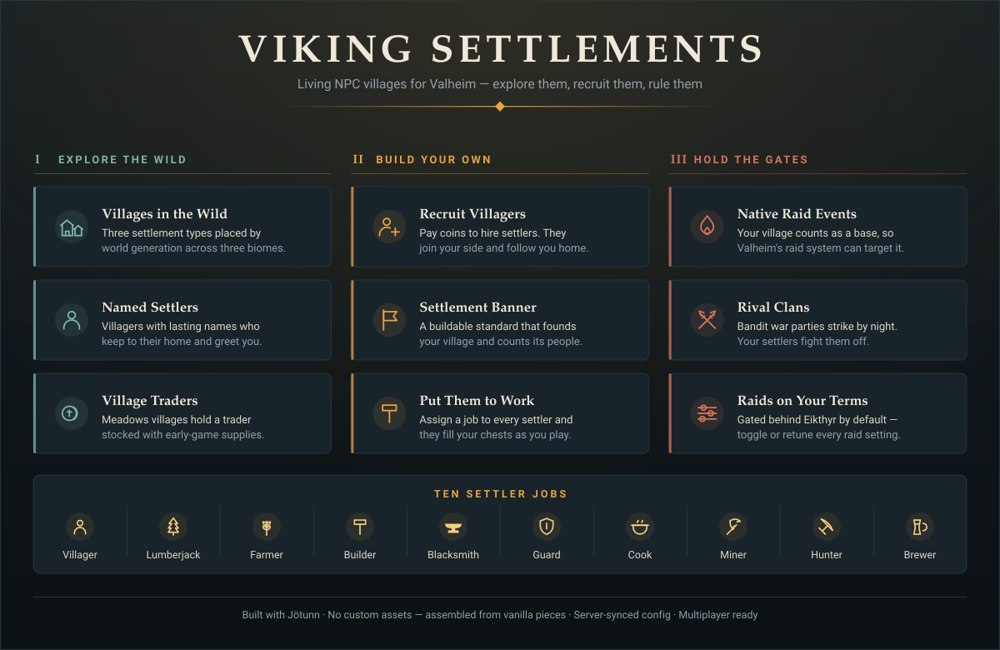

<p align="center">
  
</p>

# Viking Settlements

A [Jötunn](https://github.com/Valheim-Modding/Jotunn)-based Valheim mod that
adds **inhabited NPC settlements** to world generation, lets you **recruit
settlers**, **found your own settlement**, **assign jobs**, and **defend it
from raids**.

<p align="center">
  
</p>

## Requirements

| Dependency | Version |
|---|---|
| Valheim | 0.221.4 or compatible |
| [BepInExPack Valheim](https://thunderstore.io/c/valheim/p/denikson/BepInExPack_Valheim/) | 5.4.2333+ |
| [Jötunn](https://thunderstore.io/c/valheim/p/ValheimModding/Jotunn/) | 2.29.2+ |

The mod is marked `EveryoneMustHaveMod` — **the server and every connecting
client need it installed at the same minor version**, or clients will be
rejected at connect.

## Installation

### With a mod manager (recommended)

Install [r2modman](https://thunderstore.io/c/valheim/p/ebkr/r2modman/) or the
Thunderstore app, create a Valheim profile, and install **BepInExPack Valheim**
and **Jötunn**. Then drop `VikingSettlements.dll` into the profile's
`BepInEx/plugins` folder (in r2modman: *Settings → Browse profile folder*).
Launch the game through the mod manager.

### Manual install

1. Install **BepInExPack Valheim** — extract the archive into your Valheim
   folder so that `winhttp.dll` and the `BepInEx` folder sit next to
   `valheim.exe`. Launch the game once to let BepInEx generate its folders,
   then quit.
2. Install **Jötunn** — copy `Jotunn.dll` into `<Valheim>/BepInEx/plugins/`.
3. Install this mod — copy `VikingSettlements.dll` into
   `<Valheim>/BepInEx/plugins/`.
4. Launch Valheim. On first run the mod writes its config to
   `<Valheim>/BepInEx/config/com.abjumb.vikingsettlements.cfg`.

Typical Valheim install locations:

| OS | Path |
|---|---|
| Windows | `C:\Program Files (x86)\Steam\steamapps\common\Valheim` |
| Linux | `~/.local/share/Steam/steamapps/common/Valheim` |
| macOS | `~/Library/Application Support/Steam/steamapps/common/Valheim` |

### Dedicated servers

Install BepInEx, Jötunn and `VikingSettlements.dll` on the server exactly as
above. World-generation settings (`Locations`, `Settlement`, `Raids`) are
admin-only and are synced from the server's config to clients, so set them
server-side; purely cosmetic client settings (chatter) stay local.

### Verifying it loaded

Open `<Valheim>/BepInEx/LogOutput.log` and look for these lines:

```
[Info   :VikingSettlements] VikingSettlements v1.7.0 loaded - settlements appear in newly generated world areas
[Info   :VikingSettlements] Created settlement NPC prefab VS_Settler
[Info   :VikingSettlements] Registered location VS_MeadowsVillage (... parts, quantity 60)
[Info   :VikingSettlements] Registered bandit raid with the native random event system
```

> **Settlements only appear in terrain the game has never generated before.**
> Installing the mod on an existing save will *not* add villages to areas you
> have already explored. Start a new world, sail somewhere new, or use the
> `vs_spawn` console command below.

## What the mod does

Three new location types are woven into Valheim's world generation:

| Location | Biome | Contents |
|---|---|---|
| `VS_MeadowsVillage` | Meadows | Longhouse, cabins, farm, maypole, watchtower, trader stall, fire plaza, 7 settlers + trader |
| `VS_ForestOutpost` | Black Forest | Watchtower, cabin, stake ring, campfire, 3 settlers |
| `VS_PlainsSteading` | Plains | Stone hall, barley/flax farm, watchtower, stake ring, 4 settlers |
| `VS_ClanlessCamp` | Meadows, Black Forest, Plains | Bandit camp: shelters, loot chest, war totem, 4 raiders |

Settlements are assembled procedurally from vanilla building pieces, so no
custom assets or asset bundles are required. Settler NPCs are cloned from
vanilla humanoids and re-purposed:

- Each settler gets a persistent personal name (derived from its network id,
  so all clients agree without extra syncing).
- Settlers stay in their settlement (their AI patrol point is pinned to
  their home), fight raiding monsters, and only turn on players if attacked.
  A config option can put them on the player faction instead.
- Settlers greet players who come close (client-side chatter).
- Meadows villages include a trader (cloned from Haldor) with a small store
  of early-game supplies.
- The ground under a settlement is levelled at spawn by a one-shot terrain op.

For already-explored areas there is a console command (enable `devcommands`
first):

```
vs_spawn [village|outpost|steading|camp]
```

To locate the nearest generated settlement or camp, `vs_find` marks it on
your map with distance and direction — no cheats required, in the spirit of
Hugin's boss hints:

```
vs_find [village|outpost|steading|camp]
```

The full console reference — both mod commands, every spawnable `VS_*`
prefab, and the vanilla dev commands that exercise each system — lives in
**[docs/commands.md](docs/commands.md)**.

## Player settlements

> New here? **[Building Your First Settlement](docs/first-settlement.md)** walks
> through the whole thing step by step — what to bring, how to recruit, and the
> handful of mistakes that make settlers look broken.
> For everything about hiring — standing, prices, donations, follower care —
> see the **[complete recruiting guide](docs/recruiting.md)**.

You can found your own settlement and staff it with NPCs recruited from the
wild settlements:

1. **Recruit** — press `E` on a settler in any wild settlement and pay the
   coin cost (default 50). The settler switches to the player faction and
   follows you. `Shift+E` dismisses a follower.
   Villages track a **standing** toward players (shown on settler hover):
   defending villagers from monsters and donating coins (`Shift+E` on a wild
   settler) raise it, attacking or killing them tanks it, and each recruit
   drains it slightly. Honored villages recruit at half price; hated ones
   refuse to deal with you at all.
   The honest road to standing is the **village bounty board** by the
   plaza of every meadows village: one posting per day — deliver goods
   the village needs, or break the war totem of a named clan's camp —
   paying coins on the spot plus standing.
2. **Found a settlement** — build the *Hearthstone* (hammer → Misc, near a
   workbench; 10 wood, 5 stone and a deer trophy). Its founder owns it. A Camp
   supports up to four settlers inside 35 m, provided each has an unclaimed
   bed. Biome-material upgrades eventually reach Jarl's Seat: 64 settlers and
   a 200 m work radius. Press `E` for the persistent paged register and map
   lookup; `Shift+E` names the settlement.
3. **Assign** — with a follower inside your Hearthstone's area, press `E` to settle
   them there. Press `E` again to cycle their job, `Shift+E` to unassign.
   Every job runs on the work tick (default every 60 s) and needs the settler
   fed; producers need a chest with room in the radius, converters need
   input *and* output space **in the same chest**:
   - **Lumberjack** — 2–4 wood per tick into the nearest chest with room
   - **Farmer** — 1–2 carrots or turnips per tick; 20% chance of a honey
     (needs a beehive in the settlement)
   - **Builder** — repairs up to 3 damaged build pieces per tick, free of
     materials (needs a workbench in the settlement)
   - **Blacksmith** — one smelt per tick from your chests: copper ore →
     copper, tin ore → tin, iron scrap → iron, or wood → coal as fallback
     (needs a forge in the settlement)
   - **Guard** — no production; 60% wider alert range, holds position
   - **Cook** — one cook per tick: raw meat, deer meat, neck tail, raw
     fish, wolf or lox meat into its cooked form (needs a cooking station)
   - **Miner** — 2–4 stone per tick; 15% chance of a copper or tin ore
   - **Hunter** — 1–2 raw meat per tick; 40% chance of a deer hide, 20%
     chance of 2 feathers
   - **Brewer** — one brew per tick: 2 honey → minor healing mead or
     2 barley → barley wine (needs a fermenter)
   - **Courier** — hauls up to 8 surplus goods to another settlement
     within range and walks back; can be ambushed on the road
   - **Herder** — keeps pen animals fed from your chests, culls the herd
     above four head, and carries loose drops into storage
   - **Engineer** — keeps the settlement's ballista towers loaded with
     bolts from your chests, and fletches 4 wood turret bolts from 2 wood
     when everything is topped up (needs a workbench)
   - **Innkeeper** — once per day pours a round from the brewer's stock:
     one mead or barley wine from the chests gives every present settler
     morale, and players in the settlement get Rested refreshed (needs
     a mead hall)
   - **Fisher** — 1–2 raw fish per tick (needs open water at the
     settlement's edge)

   A **Village Seer** needs no job for her calling: an assigned seer heals
   every hurt settler in the radius each work tick, and foresees rival
   raids one night before they land.

   **Press `T` while looking at any settler to talk to them**: a panel shows
   their health, hunger and next mealtime, and a live ✓/✗ checklist of what
   their job still needs before they'll work.

   **Builders take construction orders** through that same talk menu: stand
   where the new building should go, talk to a builder, and pick a blueprint
   — *cabin* (40 wood), *watchtower* (30 wood), *fishing dock* (40 wood),
   *longhouse* (100 wood, 10 stone, Village tier), *livestock pen*
   (30 wood, Village tier), *palisade ring* (80 wood, Village tier),
   *ballista tower* (60 wood, 20 stone, Village tier), *mead hall*
   (120 wood, 20 stone, Village tier) or *stone great-hall* (60 wood,
   40 stone, Town tier).
   A construction site is marked out on the spot; builders carry materials
   into it each work tick from the **Builders' Supply Chest** (hammer →
   Misc, 10 wood) and raise the finished building when the cost is paid.
   You're warned when supplies run dry — and lumberjacks and miners
   automatically redirect their haul into the supply chest while a project
   needs it. `Shift+E` on the site cancels it.

   **Housing:** press `T` on any door inside the settlement to pick who
   lives there (blueprint cabins and longhouses come with doors and beds).
   Settlers with a home work at full speed; homeless settlers work at half
   speed and complain about it when you talk to them.
4. **Sustain** — settlers eat one food item from your chests roughly once
   per in-game day, cheapest food first. A settler that finds nothing goes
   hungry and stops working until its next meal. Keep the chests stocked and
   your settlement *grows*: each night a settlement below its cap with a
   spare unclaimed bed and food to spare has a chance to attract a newcomer.
   Settlers put down roots, too: two housed, happy settlers can **marry**
   (rolled nightly) — couples gain morale while together, settlements
   with couples grow 50% faster, and sometimes the newcomer is a child
   of the settlement come of age. A partner's confirmed death — in
   battle, or lost to an abduction deadline — leaves real grief; mere
   absence never does, so caravans and travel can't fake a widowing.
   Long-serving settlers become **veterans**: 1 XP per day of service and
   2 XP per battle survived earn them star levels with real stat scaling —
   hover text shows their rank (Veteran, Elite).
5. **Defend** — the banner emits a player-base area, so Valheim's native
   random event system can target your settlement: a custom raid event
   ("The clanless are raiding!") is registered alongside the vanilla ones
   (gated behind Eikthyr by default). Independently, rival clans roll a
   nightly chance to assault your settlement with bandit war parties, which
   your settlers — being on your faction — fight off natively. War parties
   scale with your settlement's population, and gain star levels once The
   Elder and Bonemass have fallen.
   Every camp belongs to one of **eight named clans**, and your settlement
   is raided by the clan of its nearest camp — raid messages name your
   enemy, and each war totem shows whose camp it is. It all goes into the
   **Settlement Saga** — a chronicle on the banner (Saga button in the
   management panel) of raids, warlords slain, weddings, losses and
   rescues — and settlers who stand through **three raids** earn a
   permanent epithet (*Astrid the Unbroken*) shown with their name. Raids can also
   **abduct** one assigned settler (20% by default, one captive at a time):
   the banner shows who was taken and the days left to save them — break
   the clan's camp totem before the deadline and they walk home with name,
   stars and gear intact; fail and they're gone for good, and the whole
   settlement mourns (morale). Party members are never abducted.
   The *palisade ring* and *ballista tower* blueprints exist for exactly
   these nights — the Settlement Ballista targets only enemies, and no
   turret bolt (even from vanilla ballistas you built) can hit recruited
   settlers, players or tamed animals.
6. **Strike back** — the raiders come from somewhere: *clanless camps* dot
   the world. Destroy a camp's war totem and the rival raid chance drops
   permanently (5% per camp); break ten camps and the native bandit raid
   event stops firing altogether. And when a raid brings a clan's
   **warlord**, felling him doesn't just buy peace days — it **breaks his
   clan permanently**: that clan never raids your lands again.

Jobs need somewhere to put their output: place **chests inside the settlement
radius** or lumberjacks, farmers and blacksmiths will have nothing to work
with.

<p align="center">
  
</p>

All settler state (recruiter, job, home) lives in the creature's ZDO, so it
persists across sessions and syncs to every client.

## The war party

Followers are not just cargo on the way to a settlement — up to **4** of them
form a persistent party that fights at your side. The design pillar:
**companions you can lose.** The party is strong because bringing it is a
real bet.

- **Commands** — `G` toggles the whole party between following and holding
  position; `H` orders a fall-back (they stop fighting, run to you, and take
  75% less damage — the rescue button); `Y` **focus-fires** the enemy under
  your crosshair (members falling back stay out of it — the rescue command
  outranks the kill order). `E` on a member posts them where
  they stand or brings them along; near your banner `E` still settles them
  in, and `Shift+E` dismisses. `vs_party` in the console lists the roster.
- **The Rally Standard** — a cheap plantable banner (hammer → Misc, 6 wood
  + 2 leather scraps). Press `E` on it and the party walks to the standard
  and holds there, alert and fighting: an aggressive hold point you place
  ahead of the fight instead of ordering everyone in place. `Shift+E` (or
  `G`) releases them back to your side.
- **They survive the game's traversal systems** — boarding a boat or
  stepping into a portal stows the party into your character save; they
  step out with you at the other end. Logging out pockets them the same
  way, and a member who falls too far behind teleports to you instead of
  being lost to zone unloading. Members told to hold stay posted — and are
  untouchable while you're away.
- **The permadeath contract** — a party member can only die to a monster,
  in a fight you are standing in, after telegraphed warnings (wounded at
  50%, gravely wounded at 25%, when they automatically retreat unless you
  re-engage them). You can never damage your own people — a stray cleave
  does nothing — and neither can falls, drowning, smoke or fire. Out of
  combat they regenerate, so there is no attrition tax between fights.
  But when a member dies, they are **gone** — no respawn, no backup copy.
  Veterans with stars are exactly the ones that hurt to lose.

## Configuration

Edit `BepInEx/config/com.abjumb.vikingsettlements.cfg` (created on first run):

| Setting | Default | Description |
|---|---|---|
| Locations / MeadowsVillages | 60 | Placement attempts for meadows villages (0 disables) |
| Locations / ForestOutposts | 80 | Placement attempts for black forest outposts (0 disables) |
| Locations / PlainsSteadings | 50 | Placement attempts for plains steadings (0 disables) |
| Settlers / DefendPlayers | false | Wild settlers join the player faction and fight alongside you |
| Settlers / EnableTrader | true | Meadows villages include a trader |
| Settlers / Chatter | true | Settlers greet nearby players (client-side) |
| Settlers / ChatterIntervalSeconds | 25 | Minimum time between chatter lines |
| Settlers / TalkHotkey | T | Talk to the settler you're looking at: health, hunger, job needs (client-side) |
| Recruiting / RecruitCostCoins | 50 | Coins to recruit a settler |
| Settlement / SettlementRadius | 32 | Compatibility fallback for legacy objects; Hearthstones use 35–200m tier radii |
| Settlement / WorkIntervalSeconds | 60 | Seconds between settler work ticks |
| Raids / EnableRaids | true | Enable the bandit raid event and rival clan raids |
| Raids / RaidsAfterFirstBoss | true | Raids only start once Eikthyr is dead |
| Raids / RivalRaidChancePerDay | 0.15 | Nightly chance of a rival clan raid per settlement |
| Raids / ClanlessCamps | 60 | Bandit camp placement attempts in world gen (0 disables) |
| Raids / ScaleRaids | true | War parties scale with population and boss progression |
| Raids / CampClearRaidReduction | 0.05 | Rival raid chance reduction per cleared camp (max 10) |
| Raids / AbductionChance | 0.2 | Chance a rival raid carries one settler off to the raiders' camp |
| Raids / AbductionDeadlineDays | 7 | Days to break the camp's totem before a captive is lost forever |
| Economy / FoodUpkeep | true | Settlers eat from settlement chests; hungry settlers stop working |
| Economy / MealIntervalSeconds | 1800 | In-game seconds between settler meals (~1 per game day) |
| Economy / GrowthEnabled | true | Settlements attract newcomers when beds and food allow |
| Economy / GrowthChancePerDay | 0.35 | Nightly chance of a newcomer when conditions are met |
| Economy / GrowthFoodCost | 3 | Food consumed when a newcomer arrives |
| Economy / RequireWorkstations | true | Blacksmith needs a forge, builder a workbench, honey a beehive |
| Economy / HomesMatter | true | Settlers without an assigned home (talk key on a door) work at half speed |
| Economy / MoraleEnabled | true | Settler moods affect output; rock-bottom morale makes settlers leave |
| Economy / FamiliesEnabled | true | Settlers can marry: morale together, faster growth, grief on a confirmed loss |
| Trade / CourierRange | 300 | Max distance to a partner settlement for the Courier job |
| Trade / CourierAmbushChance | 0.02 | Chance a travelling courier draws a clanless ambush |
| Progression / WarlordEnabled | true | Rival raids can bring a warlord after 3+ camps cleared |
| Progression / WarlordChance | 0.25 | Chance a rival raid includes the warlord |
| Progression / WarlordPeaceDays | 10 | Days without rival raids after felling a warlord |
| Veterancy / VeterancyEnabled | true | Settlers earn XP and star levels from service and battles |
| Veterancy / XpPerStar | 20 | XP for the first star; second star costs three times as much |
| Reputation / ReputationEnabled | true | Wild villages track standing; scales recruit costs |
| Reputation / DonationCostCoins | 10 | Coins per donation (Shift+E on a wild settler) |
| Reputation / DonationReputation | 5 | Standing gained per donation |
| Party / MaxPartySize | 4 | Villagers that can travel with you at once (max 4) |
| Party / AutoFallbackWhenGravelyWounded | true | Members below 25% health retreat to you automatically |
| Party / OutOfCombatRegenPerSecond | 2 | Member health regen after 10s without damage (0 disables) |
| Party / StanceHotkey | G | Toggle party follow/hold (client-side) |
| Party / FallbackHotkey | H | Order a protected fall-back (client-side) |
| Party / FocusFireHotkey | Y | Order the party onto the enemy under your crosshair (client-side) |

Location counts only affect world generation, so changing them has no effect
on already-generated terrain.

## Building from source

You need the [.NET SDK](https://dotnet.microsoft.com/download) (8.0 or newer).

### With Valheim installed

```sh
git clone https://github.com/abjumb/VikingSettlements.git
cd VikingSettlements
dotnet build VikingSettlements.sln -c Debug
```

The Jötunn build props auto-detect a Steam install of Valheim, so this usually
works with no configuration. If it can't find your install, set a
`VALHEIM_INSTALL` environment variable, or create `Environment.props` in the
repo root (it is gitignored):

```xml
<?xml version="1.0" encoding="utf-8"?>
<Project ToolsVersion="Current" xmlns="http://schemas.microsoft.com/developer/msbuild/2003">
  <PropertyGroup>
    <VALHEIM_INSTALL>C:\Program Files (x86)\Steam\steamapps\common\Valheim</VALHEIM_INSTALL>
  </PropertyGroup>
</Project>
```

- **Debug** builds automatically deploy the plugin to
  `<VALHEIM_INSTALL>/BepInEx/plugins/VikingSettlements/` (override with a
  `MOD_DEPLOYPATH` environment variable) — build, launch, done.
- **Release** builds package a Thunderstore-ready zip at
  `VikingSettlements/VikingSettlements.zip` instead of deploying.
- Setting `DoPrebuild.props` to `true` has Jötunn publicize your game
  assemblies automatically on the next build.

### Without Valheim installed (CI / containers)

```sh
./scripts/fetch-libs.sh          # assembles reference assemblies under vendor/
dotnet build VikingSettlements.sln -c Release
```

`fetch-libs.sh` downloads publicized game assemblies (ValheimGameLibs, NuGet),
UnityEngine reference modules (NuGet) and BepInEx 5 (GitHub releases), lays
them out like a Valheim install under `vendor/valheim`, and writes
`Environment.props` so the Jötunn build props pick them up. Don't run it if
you have a real install — you want to build against the real assemblies.

**Releasing:** pushing a `vX.Y.Z` tag makes CI build, version-check and
publish a GitHub release with the Thunderstore-ready zip attached.
Publishing that zip to Thunderstore is a drag-and-drop —
**[docs/thunderstore.md](docs/thunderstore.md)** walks through the one-time
account/team setup and each release upload.

## Testing in game

Enable the console with `F5` and type `devcommands` first; everything below
needs it.

To keep iteration bearable, temporarily set `WorkIntervalSeconds = 10` and
`RivalRaidChancePerDay = 1.0` in the config so you aren't waiting on timers.

| What to test | How |
|---|---|
| Wild settlements | `vs_spawn village` (also `outpost`, `steading`) — check buildings sit on the ground and settlers are alive |
| Recruiting | `spawn Coins 200`, walk up to a settler, look for the "Recruit" hover text, press `E` |
| Settlement banner | `spawn Wood 50`, `spawn FineWood 20`, stand near a workbench, hammer → Misc |
| Jobs | Assign a settler, place a chest in the radius, set them to Lumberjack, wait a tick |
| Native raid event | `setkey defeated_eikthyr`, then `event vs_banditraid` (`stopevent` to end it) |
| Rival clan raid | With chance at 1.0, `skiptime` until night while standing in your settlement — the message names the attacking clan |
| Abduction & rescue | Set `AbductionChance = 1.0`, trigger a rival raid, watch the banner hover for the captive, then destroy the totem at the camp `vs_find camp` points to |
| Ballista + Engineer | Order a *Ballista Tower* through a builder, set a settler to Engineer with wood in a chest, wait a couple of ticks, then `spawn VS_Raider` |
| Broken clan | Kill a raid's warlord (needs 3+ camps cleared) — `listkeys` should show a `vs_clan_broken_*` key and that clan stops raiding |
| Innkeeper feast | Order a *Mead Hall*, set an Innkeeper, `spawn MeadHealthMinor` into a chest, wait a tick — morale up, Rested refreshed |
| Families | Two housed settlers at 60+ morale, `skiptime` a few nights — expect a wedding message; talk (`T`) shows "Married to …" |
| Seer forewarning | Assign a seer (`spawn VS_Seer`, recruit, assign), raid chance 1.0 — the raid announces itself a night early |
| Bounty board | `vs_spawn village`, `E` on the board by the plaza to get a posting; `spawn Wood 20` covers most deliveries |
| Saga & epithets | `E` on your banner → Saga button; after 3 raids (`setkey`-free: chance 1.0 + `skiptime`) settlers gain epithets |
| Rally + focus-fire | Build the Rally Standard, `E` to send the party there; aim at an enemy and press `Y` to focus-fire |

If a feature is silently missing, check `BepInEx/LogOutput.log` — every vanilla
prefab the mod cannot find is logged as a `not found, skipped` warning rather
than throwing.

## Project layout

```
VikingSettlements/
├── VikingSettlements.cs        # plugin entry point, localization + manager wiring
├── ModConfig.cs                # BepInEx config entries (server-synced)
├── Npcs/
│   ├── SettlerPrefabs.cs       # clones vanilla prefabs into settler/trader/raider/ballista prefabs
│   ├── SettlerIdentity.cs      # deterministic personal names
│   ├── SettlerChatter.cs       # proximity greetings
│   ├── SettlerHome.cs          # pins AI patrol point to the settlement
│   ├── SettlerHousing.cs       # door-based home assignment
│   ├── SettlerRecruitable.cs   # recruit/follow/assign state machine + job cycling
│   ├── SettlerWork.cs          # job effects (produce, convert, repair, engineer)
│   ├── SettlerNeeds.cs         # live job-requirement checks for the talk panel
│   ├── SettlerTalkPanel.cs     # the T-hotkey talk UI (needs, moods, blueprints)
│   ├── SettlerEquipment.cs     # player-given weapons and armor
│   ├── SettlerMorale.cs        # moods from housing, food, company and raids
│   ├── SettlerCourier.cs       # caravan journeys between settlements
│   ├── SettlerVeterancy.cs     # XP and star levels
│   ├── SettlerFamily.cs        # marriages, grief, together-bonuses
│   ├── SettlerReputation.cs    # wild-village standing hooks
│   ├── VillageHeart.cs         # wild village reputation anchor
│   └── RaiderDespawn.cs        # cleans up unbeaten raiders
├── Party/
│   ├── PartySystem.cs          # roster, hotkeys, focus-fire, traversal stow/unstow
│   ├── PartyMember.cs          # stances, regen, auto-retreat, rally orders
│   ├── RallyPoint.cs           # the plantable Rally Standard piece behavior
│   └── PartyPatches.cs         # the permadeath-contract damage patch
├── Settlements/
│   ├── PlayerSettlement.cs     # banner behavior: population, tiers, raid rolls, captives
│   ├── SettlementPieces.cs     # buildable banner + supply chest pieces
│   ├── SettlementPanel.cs      # the banner management UI
│   ├── SagaPanel.cs            # the settlement chronicle UI
│   ├── Blueprints.cs           # orderable builder blueprints
│   ├── ConstructionSite.cs     # material tracking + build completion
│   ├── BuildChest.cs           # the builders' supply chest
│   ├── HomeAssignPanel.cs      # who-lives-here door UI
│   ├── MeadHallMarker.cs       # the marker the Innkeeper job gates on
│   ├── SettlerGearPanel.cs     # the equipment hand-over UI
│   └── UiPalette.cs            # shared UI colors
├── Raids/
│   ├── RaidEvents.cs           # native RandEventSystem integration
│   ├── RaidSpawner.cs          # rival clan war parties + warlords
│   ├── ClanNames.cs            # the eight named clans + broken-clan keys
│   ├── Abduction.cs            # captive records, rescues and deadlines
│   ├── BountyBoard.cs          # wild-village bounty postings
│   ├── CampTotem.cs            # camp-clear keys + clan hover
│   └── WarlordFall.cs          # peace days + clan breaking on warlord death
├── World/
│   ├── SettlementLayout.cs     # data-driven blueprint DSL
│   ├── Layouts.cs              # the actual settlement blueprints
│   ├── LayoutBuilder.cs        # instantiates blueprints (locations & command)
│   └── SettlementLocations.cs  # ZoneManager registration
└── Commands/
    ├── SpawnSettlementCommand.cs
    ├── FindSettlementCommand.cs
    └── PartyCommand.cs
```

All vanilla prefab references are resolved defensively — after a game update
a renamed prefab logs a warning and is skipped instead of breaking world
loading.

## Known limitations

- Settlement structures are placed on Valheim's build grid from code; exact
  piece pivots can only be fine-tuned in game, so expect some rustic
  imperfections in roofs and gables.
- Settlers use dvergr models (the closest vanilla friendly humanoids with
  full combat AI). Custom player-model settlers would need a Unity asset
  bundle, which this repo's Unity project supports as a follow-up.
- Killed settlers do not respawn — settlements can be wiped out by raids.

## Debugging

See the Wiki page [Debugging Plugins via IDE](https://github.com/Valheim-Modding/Wiki/wiki/Debugging-Plugins-via-IDE)
for more information.

## Credits

Built on [Jötunn](https://github.com/Valheim-Modding/Jotunn), the Valheim
modding library. The build tooling and Unity project scaffolding originally
came from the [JötunnModStub](https://github.com/Valheim-Modding/JotunnModStub)
template (MIT No Attribution) and have since been reworked for this project.

## License

Released under the [MIT License](LICENSE).
