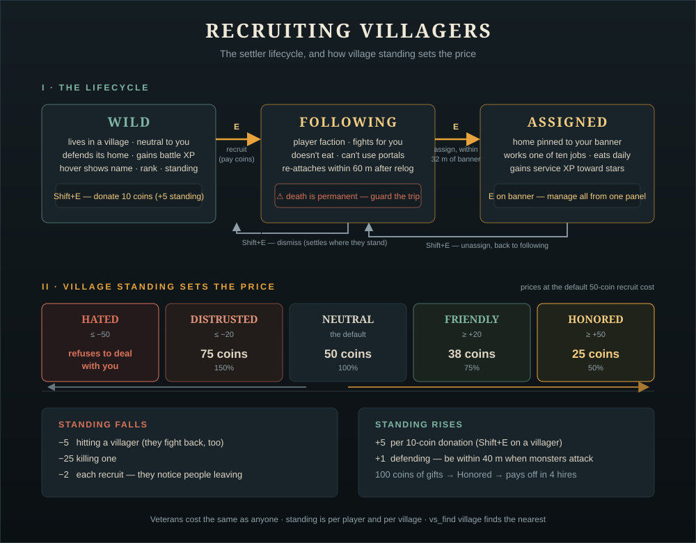

# The Complete Guide to Recruiting Villagers

Everything about turning wild villagers into your own settlers: where to find
them, what they cost, how village standing changes the price, and what
happens at every step from first hello to assigned job.

## The short version

1. `vs_find village` → walk there
2. Press **E** on a villager, pay the coins — they follow you
3. Build an unclaimed bed and walk them inside your Hearthstone's radius
4. Press **E** again — they settle there
5. Press **E** on the Hearthstone to manage the persistent register

Everything below is the detail.

## Where villagers live

Three kinds of wild settlement hold recruitable villagers:

| Settlement | Biome | Population |
|---|---|---|
| Village | Meadows | 6 settlers + 1 seer (and a trader — **not** recruitable) |
| Outpost | Black Forest | 3 settlers |
| Steading | Plains | 3 settlers + 1 seer |

`vs_find village` (no cheats needed) marks the nearest one on your map with
distance and direction. **Seers** are support mages — they heal and shield
allies in a fight, which makes them the best defensive recruit in the game.

Villagers keep their **personal name** and their **veterancy rank** through
recruitment. That last part matters — see "Recruit veterans" below.

## Village standing — the price you'll pay

Every village (generated since v1.7) tracks a shared **standing** toward
players, from −100 to +100. It shows on every villager's hover text, and it
directly sets the recruit price:

| Standing | Threshold | Recruit cost (at default 50) |
|---|---|---|
| **Honored** | ≥ 50 | 25 coins (50%) |
| **Friendly** | ≥ 20 | 38 coins (75%) |
| **Neutral** | — | 50 coins |
| **Distrusted** | ≤ −20 | 75 coins (150%) |
| **Hated** | ≤ −50 | **they refuse entirely** |

**Raising it:**

- **Donate** — `Shift+E` on any wild villager gives 10 coins for **+5**
  standing. From Neutral, 40 coins of gifts reaches Friendly; 100 reaches
  Honored.
- **Defend** — when a monster attacks a villager and you're within 40 m,
  the village credits you **+1** (at most once a minute). Hang around during
  a greydwarf rush and your name improves on its own.
- **Work the bounty board** — meadows villages post one job per day on the
  board by the plaza: a delivery pays **+5** standing plus 30–40 coins,
  breaking a clan camp's war totem pays **+15** plus 150 coins. The only
  method that *earns* coins instead of spending them.

**Lowering it:**

- Hitting a villager: **−5** (and they'll fight back — the whole village
  aggravates, vanilla-style)
- Killing one: **−25**
- Each recruit: **−2** — the village notices its people leaving

The math favors generosity: reaching Honored costs about 100 coins of
donations and then saves 25 coins on *every* hire — it pays for itself by the
fourth recruit, and everything after is profit.

Villages generated before v1.7 have no standing tracker: no standing line on
hover, flat price, no donate option. (`spawn VS_VillageHeart` at the village
center retrofits one — see the [command reference](commands.md).)

## Recruiting

Walk up, look at the hover text — name, rank, standing, price — and press
**E**. The coins leave your inventory, you get "*«name» joins you!*", and
they're yours.

What actually changes:

- They switch to the **player faction** — monsters attack them, they fight
  for you and alongside your other recruits.
- They **follow you** like a tamed wolf follows.
- They stop reporting to their old village — nothing they do from now on
  affects that village's standing.
- They keep their name, their veterancy rank, and their XP.

If the hover says **"They refuse to deal with you"**, the village hates you
(≤ −50). Donations still work — you can buy your way back up, ten coins at a
time.

## The follower phase

Between recruitment and settlement, your villager is a follower. Know these
five things:

1. **They fight, and they can die — permanently.** There is no respawn for a
   named settler. Marching followers through a swamp at night is how you
   lose a two-star Elite you can't replace.
2. **They keep up, mostly.** If you sprint far ahead, teleport, or log out,
   a follower waits where they lost you. Come back within **60 m** and
   they'll pick you up again automatically — they re-attach to their
   recruiter after a relog, too.
3. **Followers don't eat.** Meal upkeep only applies to *assigned* settlers,
   so a long journey home costs no food.
4. **Portals don't move them.** Followers walk; they cannot take portals.
   Recruit near home, or bring them by boat the long way (they'll wait at
   the dock — walk them ashore).
5. **`Shift+E` dismisses a follower on the spot.** They go back to being a
   wild villager and settle down *right where they're standing* — they do
   not walk home. A dismissed follower far from any village just lives
   there now, still recruitable later at the standing of... no village, so
   flat base price.

## Settling them in

Stand your follower inside a **Hearthstone you founded** and press **E**:

- "*«name» settles here!*" — they stop following, pin their home to the
  banner, and start life as a **Villager** (the do-nothing job).
- Give them a real job: **E on them** cycles jobs, or **E on the Hearthstone**
  opens the paged register and does it from one screen.
- From this moment they **eat from your chests** (once per game day,
  cheapest food first) and earn **1 XP per day of service**.

Assignment can be refused for three explicit reasons: this is not your
Hearthstone, the biome tier has reached its population ceiling, or there is no
spare unclaimed bed. Build housing, upgrade the Hearthstone with the material
shown on its hover text, or found another settlement.

`Shift+E` on an assigned settler un-assigns them back into a follower — how
you move people between settlements.

## Getting the most out of recruiting

- **Recruit veterans.** Wild villagers earn battle XP fighting off monsters,
  so old villages contain **Veteran** and even **Elite** villagers — and
  rank doesn't change the price. A 2-star Elite for the same 50 coins is
  the best deal in the mod. Check hover text before you buy.
- **Take the seer.** Support mages heal and shield your other settlers
  during raids. One seer per settlement changes raid outcomes.
- **Donate before a hiring spree, not after.** Standing discounts apply per
  recruit, so push to Friendly/Honored *first*, then hire the village out.
- **Spread your recruiting.** Each recruit is −2 standing, so emptying one
  village pushes it toward Distrusted prices. Three villages at Friendly
  beat one village ground down to Distrusted.
- **Guard the walk home.** The trip is the dangerous part. Recruit in
  daylight, clear the route, and don't pull trolls.

## Multiplayer notes

- Standing is **shared by all players** — your friend's massacre raises
  your prices too.
- A follower follows **their recruiter** specifically. Only that player can
  dismiss or re-job them, and only the founder can manage or upgrade a
  Hearthstone.
- All of this syncs through the world save; there's no per-client state to
  desync.

## Troubleshooting

| Symptom | Cause |
|---|---|
| "They refuse to deal with you" | Standing ≤ −50. Donate your way back up |
| No standing line on hover | Pre-1.7 village — works fine at flat price |
| Follower stopped following | You got >60 m away or relogged. Walk back within 60 m |
| "No Hearthstone founded by you..." | Move inside one of your Hearthstone's current tier radii |
| "Upgrade the Hearthstone..." | The tier population ceiling is full; provide the shown biome materials |
| "Build another unclaimed bed..." | Every population slot also needs a bed owned by no player |
| Can't recruit the trader | By design — he likes his stall |
| Recruit prompt shows the wrong price | Price updates with standing; donate or misdeeds since your last look moved it |

Config knobs for recruiting remain `RecruitCostCoins`, `DonationCostCoins`,
`DonationReputation` and `ReputationEnabled`. Hearthstone population and work
radii are fixed progression values — see [Hearthstone settlements](HEARTHSTONE.md).
